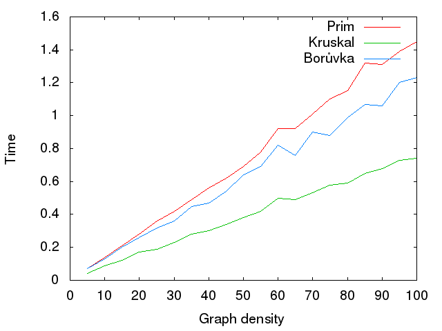

Сравнение алгоритмов построения минимального остовного дерева
=========================
Домашнее задание, в котором надо было сравнить время работы алгоритмов Борувки, Краскала и Прима на случайных графах.

Скомпилировать: `make`

Запустить тесты: `make test`

Нарисовать график зависимости времени работы от плотности графа на тестах (нужен gnuplot): `make plot`

Собрать pdf'ку с небольшим «анализом» полученных результатов: `make analysis`

Очистить всё сгенерированное, кроме pdf'ки: `make clean`

